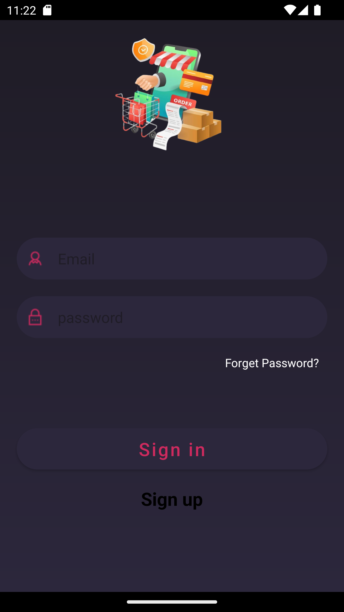

# mobile Project

.

## Members

1. **Mohamed Amine Guesmi**
2. **Firas Mosbahi**
3. **Anas Chaibi**

## Project Documentation

### Idea

**Our Mobile application is e-commerce app where user can order the product that he likes or just scroll to see them and see what’s new .**

### F**unctioning**

### LogIn

**user can log in to the app using his credentials (email, password )** 

**if the user provide a wrong password , error message will be displayed to indicated that he need to provide other password** 

**if the email is wrong and he did not provide any password then other error message will be provided to him** 

**Once the user complete his Login Successfully he will be directed to the Home Page and he will not need to do the login other time after closing the app he will be directed to the Home Page only if the user delete the app then he will need to provide again his password and email .**

### signup

**if the user has no account he can easily make a new account with some simple steps** 

- **Email Step**
    
    
    
    **user provide the email and he has to validate it  . if the format of the email is wrong then error msg will be provided to him**
    
    
    
    
    
- **Password Step**
    
    
    
    **User can provide his password (password length must be at least 6 and the passwords have to be the same or un error msg will show and he can’t go to the next step )**
    
    
    
- **Basic Information Step**
    
    
    
    **User can provide his First Name and Last Name and date Of Birth (this are optional user is not obliged to provide them) . Once he complete this step the account will be created and he will goes to the Home Page** 
    
    **if there are any error on creating the account (like email already exists ) he will return to email step** 
    
    
    

### Home Page

**User can see all the products in Home** 

- **Home**
    
    
    
    **if he need to see all product he just have to press “All Products” or to see the products of one category he just have to select the category and the products will change** 
    
    
    
    **if he need to search for one item by name he just has to provide the name or character and the products will be displayed that match his input** 
    
    
    
    **if he need to see the details of any products he just have to press the product** 
    
    
    
    **if he liked and decide to buy it he just have to click “Add To Card” and once he navigate to Cart he will see the product or he can just return to Home** 
    
    **if he liked a product he can add them to The Favorite just press the heart icon** 
    
    
    
- **Cart**
    
    **after adding some items to cart the user can navigate to the cart to see them** 
    
    
    
    **he can select the quantity as he like and the value will be provided for him** 
    
    
    
    **he can delete any product that he add to the cart** 
    
    **alse if he exit the app and return he will find them like they were ,we save them for him**
    
    **once he decide to order them he can just press “Order Now”**
    
    
    
    **if he cancel then nothing will change but if he confirm then the product will be ordered for him** 
    
    
    
- **Favorite**
    
    **user can see the product that he added them to favorite and they will be saved for him if he exit the app** 
    
    
    
    **he can search between them for any specific product or he can delete one by pressing the heart again** 
    
- **Error Handling**
    
    **if there are no internet popup will appear to suggest the user that there is not network and he need to try again** 
    
    
    
    **if an error happened inside the app like a api falls or he disconnect the internet inside un error popup will appear** 
    
    
    

### the decisions of design taken.

**The choices made in designing the app aim to make it user-friendly and easy to navigate. For the login process, we keep things simple by using a single screen. Sign up is divided into three steps, each in a different part of the screen, making it easy to move through the process.**

**On the home page, we stick to one main screen but break down the functionality into four parts, each on its own screen and we make other navigation for this process. This setup makes it simple for users to switch between different things they want to do in the app.**

**Behind the scenes, we use a design pattern MVVM, which helps keep the code organized and easy to manage. For connecting to the internet and getting data, we use a tool called Retrofit. We've also set up our own server to provide the app with the information it needs. This way, we have more control over how the app works, making it faster and more tailored to what users need. Overall, these design choices are meant to create an app that's easy to use and works smoothly.**
